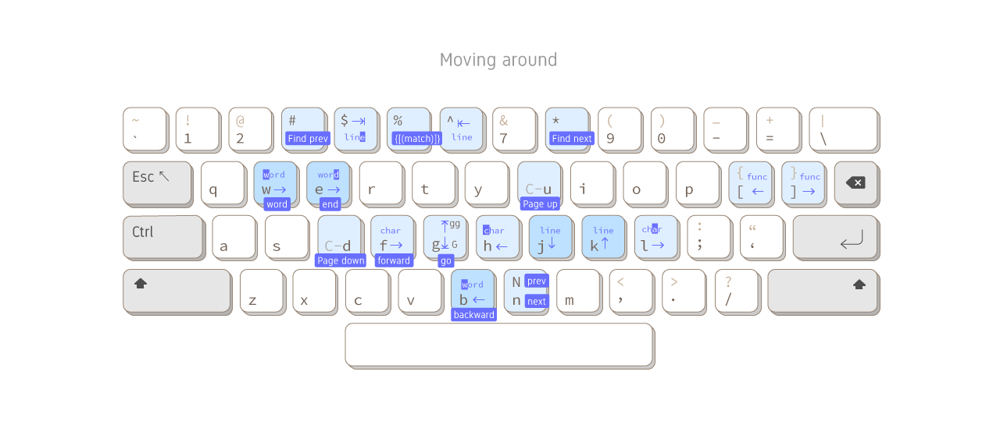
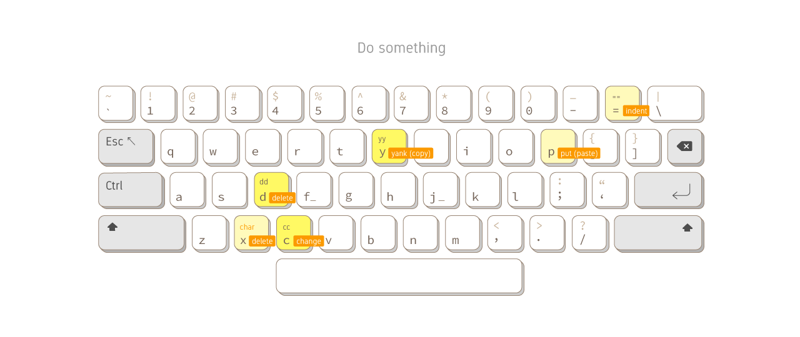

# Vim Visual Cheat Sheet

Take visual notes of how I use so far. It is interesting to see how Vim takes up the whole keyboard. Most of them are Vim's default, except some customization I put gray notes on them.

After making these graphs I realize there are too many functions to fit inside.

For my Vim configuration see [tanyuan/vim-config](https://github.com/tanyuan/vim-config).

